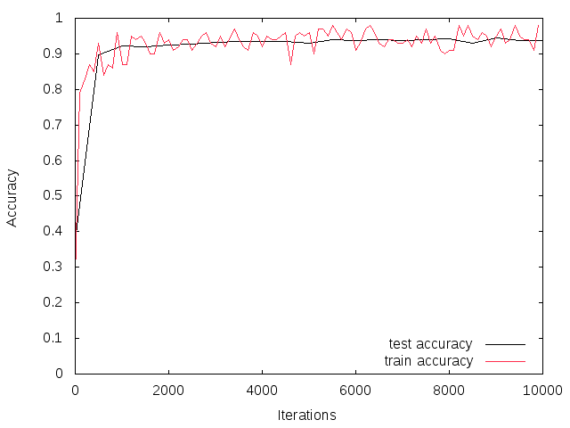
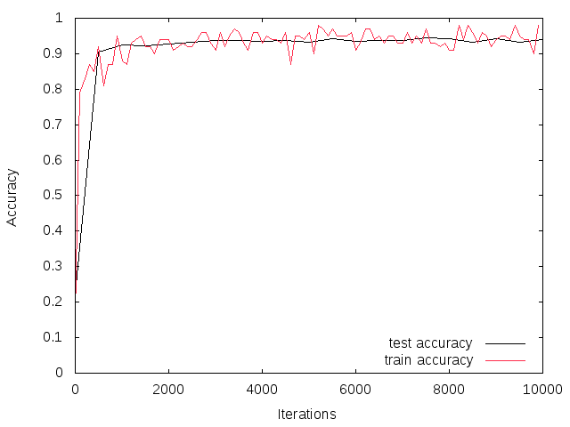
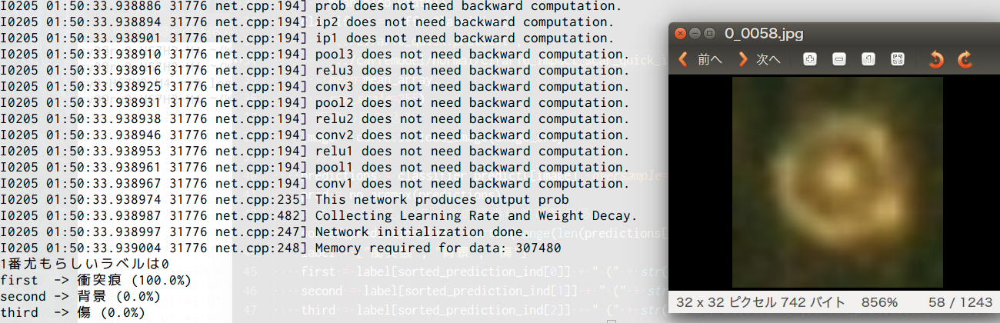
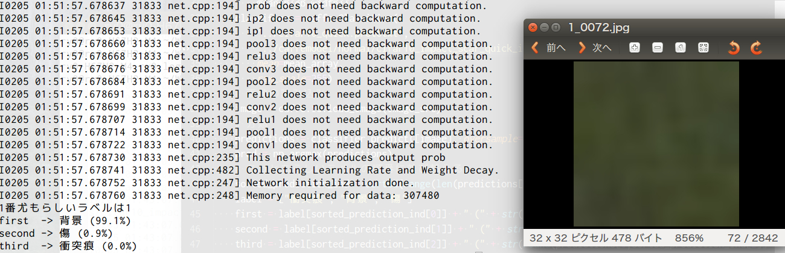
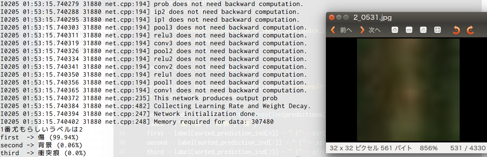
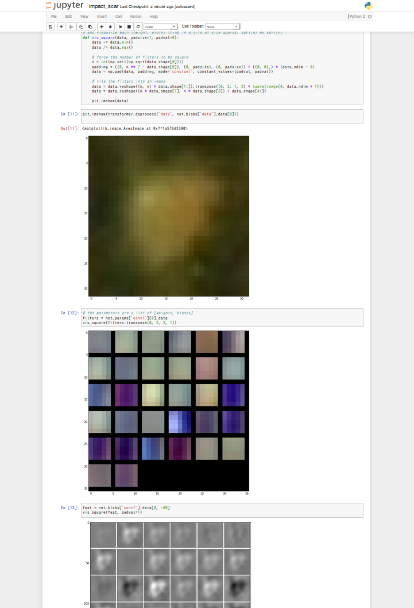

# 衝突痕検出のやつ
## このリポジトリ

```bash
.
├── caffemodel
│   ├── normal # ふつうのcifar10で学習を行った時のCaffeモデル
│   │   ├── cifar10_impact_scar_quick_iter_10000.caffemodel
│   │   ├── cifar10_impact_scar_quick_iter_10000.solverstate
│   │   ├── cifar10_impact_scar_quick_iter_5000.caffemodel
│   │   └── cifar10_impact_scar_quick_iter_5000.solverstate
│   └── padded # データの水増しあり
│       ├── cifar10_impact_scar_quick_padded_iter_10000.caffemodel
│       ├── cifar10_impact_scar_quick_padded_iter_10000.solverstate
│       ├── cifar10_impact_scar_quick_padded_iter_5000.caffemodel
│       └── cifar10_impact_scar_quick_padded_iter_5000.solverstate
├── cifar10_quick.prototxt
├── cifar10_quick_padded.prototxt
├── cifar10_quick_solver.prototxt
├── cifar10_quick_solver_padded.prototxt
├── cifar10_quick_train_test.prototxt
├── cifar10_quick_train_test_padded.prototxt
├── dataset # データセット ここにはアップしてません
│   ├── 0
│   │   ├── 0_0001.jpg
│   │   ├── 0_0002.jpg
│   │   ├── 0_0003.jpg
│   │   ├── 0_0004.jpg
省略
│   ├── 2
│   │   ├── 2_4322.jpg
│   │   ├── 2_4323.jpg
│   │   ├── 2_4324.jpg
│   │   ├── 2_4325.jpg
│   │   ├── 2_4326.jpg
│   │   ├── 2_4327.jpg
│   │   ├── 2_4328.jpg
│   │   ├── 2_4329.jpg
│   │   └── 2_4330.jpg
│   └── build_leveldb.py # データセット作成用スクリプト．今回は学習データとテストデータの比率は5:1
├── image # 結果の画像をここに置いてます
│   ├── ipython.png
│   ├── label_0.jpg
│   ├── label_1.jpg
│   ├── label_2.jpg
│   ├── normal.png
│   └── padded.png
├── ipynb # iPythonNotebookの実行ファイル
│   └── impact_scar.ipynb
├── mean.binaryproto # 平均画像
├── plot # 学習結果
│   ├── normal
│   │   ├── normal.test
│   │   ├── normal.train
│   │   └── plot_log.plt
│   └── padded
│       ├── padded.test
│       ├── padded.train
│       └── plot_log.plt
├── python # 分類を行うテストプログラム
│   └── impact_scar_classify.py
└── readme.md # このREADME
```

## Clone

```bash
cd caffe/examples/
git clone https://github.com/Ry0/cifar10_impact_scar.git
```

## データセット
ラベルは以下の通り
 
|ラベル|フォルダ名|
|:--:|:--:|
|衝突痕|0|
|背景|1|
|傷|2|

平均画像の名前は`mean.binaryproto`として学習器の設定をしている．

```bash
build/tools/compute_image_mean.bin -backend=leveldb ./examples/cifar10_impact_scar/cifar10_impact_scar_train_leveldb ./examples/cifar10_impact_scar/mean.binaryproto
```

## 学習
### Cifar10のモデルそのまま
ただし学習のイテレーションは4000ではなく多めの10000．
`cifar10_quick_solver.prototxt`を見てください．少し他の値も変更しています．

```bash
build/tools/caffe train --solver examples/cifar10_impact_scar/cifar10_quick_solver.prototxt
```



###データの水増しあり
トリミング，ミラーなどやってみたけど，あまり精度は向上しなかった．

```bash
build/tools/caffe train --solver examples/cifar10_impact_scar/cifar10_quick_solver_padded.prototxt
```



### dropoutあり
試してません

## 分類してみるプログラム
### 実行

```bash
cd caffe/examples/cifar10_impact_scar/python
python cifar10_impact_scar.py hogehoge.jpg
```

### 結果
1と2の区別をミスする場合が少しあった．







## iPython Notebook
### iPython Notebookの導入
インストールはここを見て過去にやった気がします．

> IPython Notebookでかっこいいグラフを書く  
> [http://yymm.bitbucket.org/blog/html/2013/10/03/ipython_entrance.html](http://yymm.bitbucket.org/blog/html/2013/10/03/ipython_entrance.html)

### 起動から各スクリプト実行

```bash
cd caffe/examples/cifar10_impact_scar/ipynb
ipython notebook ./ --profile=myserver
```

成功するとブラウザが開く．
`impact_scar.ipynb`をブラウザで選択して開く．  
`In [1]:`から順番に`Shift` + `Enter`で実行していく．
学習モデルを変更したい場合も，ブラウザから書き換えられる．
例，`In [2]:`のモデルなど

```python

caffe.set_mode_cpu()

net = caffe.Net(caffe_root + 'examples/cifar10_impact_scar/cifar10_quick.prototxt',
                caffe_root + 'examples/cifar10_impact_scar/caffemodel/normal/cifar10_impact_scar_quick_iter_10000.caffemodel',
                caffe.TEST)
```


`In [5]:`で**入力した画像**がPredicted class is #0.と言っています．

あとは中間層の確認ができます．

私の環境で試したときの結果を閲覧する場合は下の画像をクリック

[](https://github.com/Ry0/cifar10_impact_scar/blob/master/ipynb/impact_scar.ipynb)

## これから...
* ラベルを増やしてやってみてください．
* 精度を求めるのであれば，Cifar10の`full_train`をコピーしてきて，`quick`じゃないやつを試してみてください．
* ラベリングしたあとの結果を使って，複数衝突痕がある写真に対しても対応できるように（今までのプログラムを書き換えるだけでいけるはず）
* がんばって！